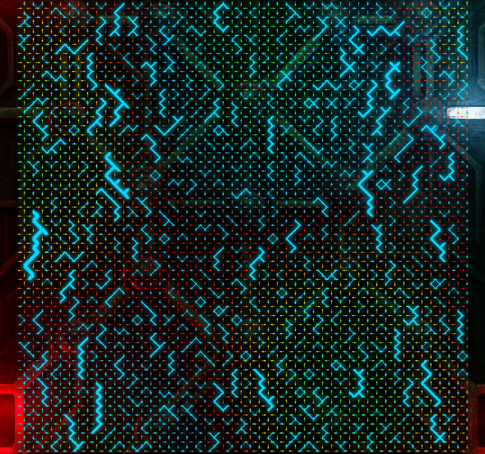

# Six Vertex Model Visualization App

This app visualizes ground state ice configurations of the six vertex model, a classic model in statistical mechanics. It features an interactive frontend for generating and exploring random configurations, and a Python backend for generating valid six vertex states.

## Features

- **Interactive grid controls:** Set grid width (Lx), height (Ly), and number of down spins (N).
- **Dynamic visualization:** Animated rendering of the six vertex model with color-coded arrows and defect highlighting.
- **Backend API:** FastAPI server generates valid six vertex configurations using numpy.

## Project Structure

- `backend/`: FastAPI server (`main.py`) for generating six vertex model configurations.
- `frontend/`: Vue 3 + Vite frontend for visualization and user interaction.
- `images/`: Background and static images.

## Usage

1. **Install backend dependencies:**
   ```
   pip install -r backend/requirements.txt
   ```

2. **Run the backend server:**
   ```
   uvicorn backend.main:app --reload
   ```

3. **Install frontend dependencies:**
   ```
   cd frontend
   npm install
   ```

4. **Run the frontend dev server:**
   ```
   npm run dev
   ```

5. **Open the app:**  
   Visit the local frontend URL (usually http://localhost:5173) in your browser.

## How it works

- The frontend sends grid parameters to the backend API.
- The backend generates a random valid six vertex configuration and returns the spin arrays.
- The frontend renders the configuration as an animated grid with arrows and defects.

## License

MIT License

---

Fun visualization app for ground state ice configurations of the six vertex model.
